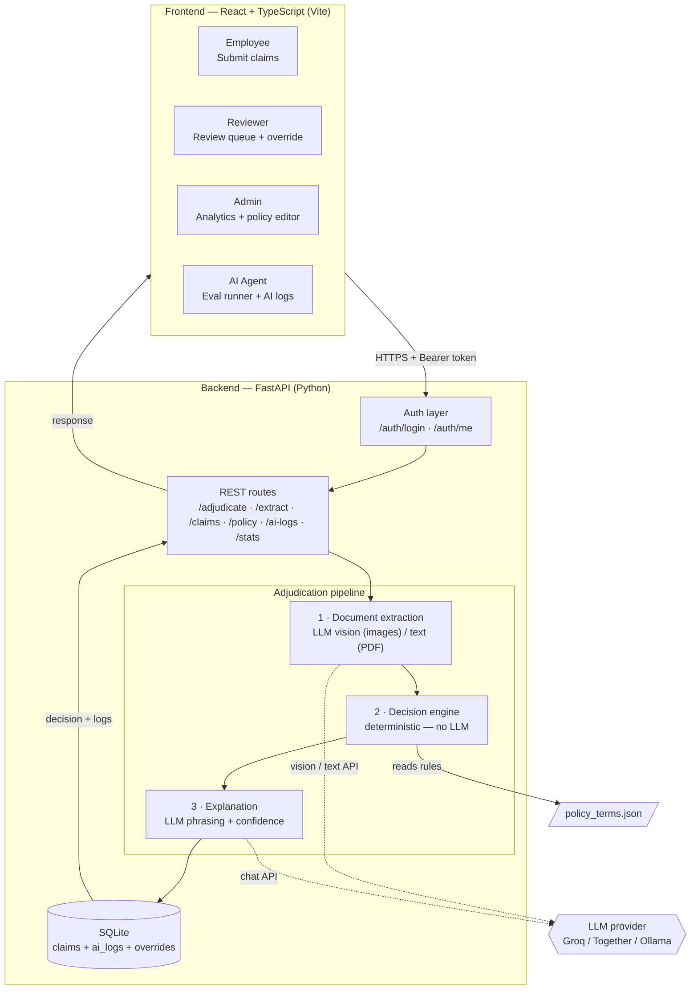
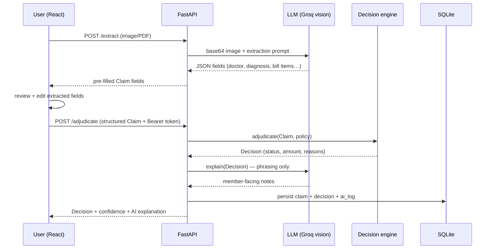
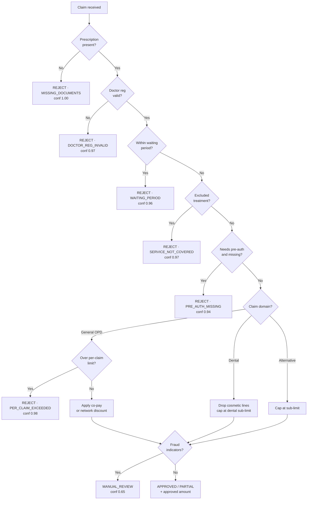
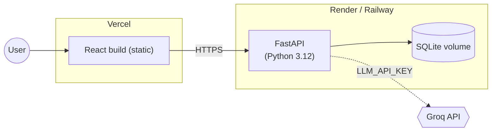

# Architecture — OPD Claim Adjudication Tool

An AI-assisted system that automates the approval/rejection of outpatient
(OPD) insurance claims. A user uploads medical documents; the system extracts
the relevant fields, evaluates them against the policy, and returns a decision
(APPROVED / REJECTED / PARTIAL / MANUAL_REVIEW) with reasoning and a confidence
score.

---

## 1. Design principles

1. **Hybrid AI + deterministic split.** The LLM does *language* work
   (reading documents, phrasing explanations); a plain rule engine does all
   *decisions and arithmetic*. The LLM never computes an amount or decides an
   outcome — keeps money exact, decisions reproducible, and logic auditable.
2. **Swappable layers.** OCR, extraction, engine, explanation, and storage
   each sit behind a small interface. Any one can be replaced without touching
   the others.
3. **Config-driven rules.** Coverage limits, sub-limits, waiting periods, and
   exclusions live in `policy_terms.json` — editable live from the admin UI.
4. **The test cases are the spec.** All 10 provided cases are encoded as an
   automated suite; the engine is correct only when all 10 pass.

---

## 2. System architecture



---

## 3. Request lifecycle

### Document upload path


### Direct structured submission (test suite path)
Skips extraction entirely — posts a JSON `Claim` directly to `/adjudicate`.

---

## 4. Components

| # | Layer | Responsibility | Tech | Key files |
|---|-------|----------------|------|-----------|
| — | Frontend | Role-based UI (Employee / Reviewer / Admin / AI Agent) | React 19, TypeScript, Vite, Tailwind | `frontend/src/pages/*` |
| — | Auth | Token-based role auth, session persistence | In-memory token store (production: JWT) | `app/auth.py` |
| 1 | Extraction | Image → LLM vision → validated fields; PDF → text layer → LLM | OpenAI-compatible API (Groq) | `app/llm.py` |
| 2 | Decision engine | Eligibility, coverage, limits, fraud — fixed precedence, pure Python | Pure Python | `app/engine/`, `app/classify.py` |
| 3 | Explanation | LLM writes member-facing notes; blends with engine confidence | LLM (same provider) | `app/llm.py` |
| 4 | Storage | Claims, decisions, AI call logs, reviewer overrides | SQLite (sqlite3) | `app/database.py` |
| — | Policy config | Single source of truth — edited live by admin | JSON | `policy_terms.json` |

---

## 5. Decision engine logic

Checks run in fixed precedence so the *correct* reason fires when several apply.



---

## 6. Data model

**`Claim`** (extraction output → engine input)

`member_id`, `member_name`, `member_join_date?`, `treatment_date`,
`claim_amount`, `hospital?`, `cashless_request`, `pre_authorized`,
`previous_claims_same_day`, `prescription { doctor_name, doctor_reg,
diagnosis, medicines_prescribed[], procedures[], tests_prescribed[],
treatment? }`, `bill { line_item: amount }`.

**`Decision`** (engine output → API response)

`claim_id`, `decision`, `approved_amount`, `rejection_reasons[]`,
`rejected_items[]`, `flags[]`, `deductions { copay | network_discount }`,
`cashless_approved?`, `confidence_score`, `notes`, `next_steps`.

**`AILog`** (logged per LLM call)

`call_type`, `model`, `prompt_preview`, `response_preview`,
`prompt_tokens`, `completion_tokens`, `latency_ms`, `status`, `created_at`.

---

## 7. Role-based UI

| Role | Dashboard | Access |
|------|-----------|--------|
| **Employee** | Submit claims, document upload + AI extraction, own history table | Own claims only |
| **Reviewer** | Review queue (MANUAL_REVIEW flagged), stats bar, override panel with reason | All claims |
| **Admin** | KPI analytics, decision breakdown chart, claims table, **live policy editor** | All claims + policy write |
| **AI Agent** | AI activity log (every LLM call: tokens, latency, I/O), auto-refresh, evaluation runner (10 test cases, accuracy %) | AI logs + all claims |

---

## 8. Technology stack and rationale

| Area | Choice | Why |
|------|--------|-----|
| Frontend | React 19 + TypeScript + Vite + Tailwind | Fast iteration, typed, recommended stack |
| Backend | FastAPI (Python) | Async, Pydantic validation, auto Swagger docs at `/docs` |
| Document AI | LLM vision (Groq llama-4-scout) | No system dependencies, handles handwritten prescriptions, zero OCR setup |
| LLM provider | Open-source via OpenAI-compatible API | No per-call cost lock-in; swap provider with one env var |
| Storage | SQLite (built-in sqlite3) | Zero-config MVP; Postgres-ready schema |
| Auth | In-memory token store | Simple for demo; production replaces with JWT |

Provider switching requires only `.env` changes:
```
LLM_BASE_URL=https://api.groq.com/openai/v1   # or Together / local Ollama
LLM_API_KEY=…
LLM_MODEL=llama-3.3-70b-versatile
LLM_VISION_MODEL=meta-llama/llama-4-scout-17b-16e-instruct
```

---

## 9. Deployment



No Tesseract or poppler required — using LLM vision for document reading means
a plain Python deployment with no system-package dependencies.

---

## 10. Scaling to production

- **Stateless API** → multiple FastAPI workers behind a load balancer.
- **Async LLM calls** → move to a task queue (Celery/RQ) so uploads return immediately.
- **Database** → swap SQLite for PostgreSQL; index on `member_id` + `treatment_date` for annual-limit tracking.
- **Document storage** → S3 / object storage instead of memory.
- **Policy cache** → Redis for the policy JSON; version with an audit log.
- **Auth** → JWT with refresh tokens, RBAC roles in DB.
- **Rate limiting** on upload and LLM endpoints.

---

## 11. Resolved ambiguities

The provided rules and expected test outputs conflict in a few places; expected
outputs were treated as ground truth:

1. Co-pay (10%) applies to the whole general-OPD bill; dental and alternative-medicine carry no co-pay.
2. Per-claim limit applies to general OPD only — not dental (dental sub-limit governs).
3. 20% network discount replaces co-pay for network/cashless claims.
4. MRI/CT require pre-authorisation despite the category flag.
5. AYUSH registration formats (`AYUR/State/Number/Year`) are accepted.
6. Exclusions matched semantically — "diet plan" maps to "Weight loss treatments".
7. Confidence scores calibrated to rule determinism (1.00 = certain, 0.65 = manual review).

---

## 12. Implementation status

| Phase | Scope | Status |
|-------|-------|--------|
| 1 | Data contracts, policy loader, deterministic engine, FastAPI | ✅ Done — 10/10 test cases pass |
| 2 | LLM vision extraction from uploaded images/PDFs | ✅ Done |
| 3 | LLM explanation + confidence; SQLite persistence | ✅ Done |
| 4 | React frontend — 4 role dashboards, document upload, history | ✅ Done |
| 5 | Admin policy editor, AI activity log, eval runner, auth | ✅ Done |
